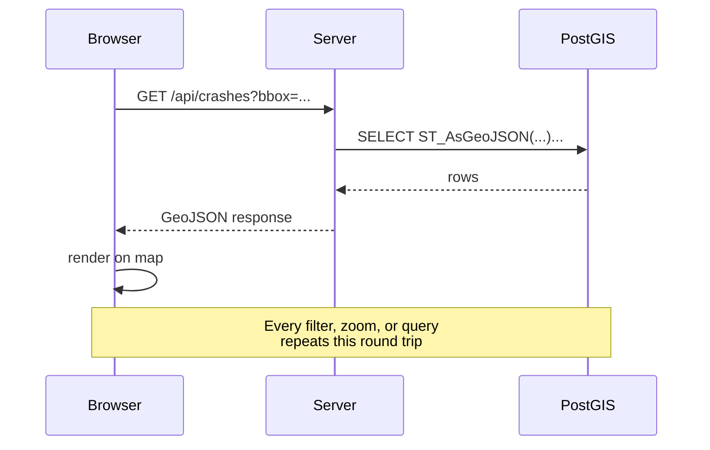
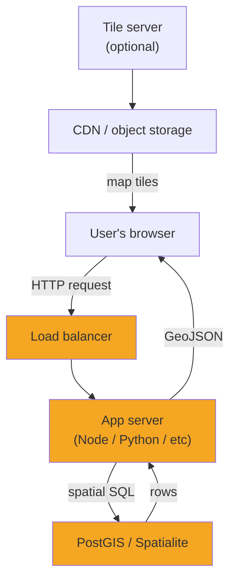
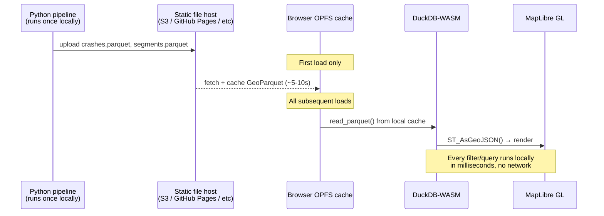
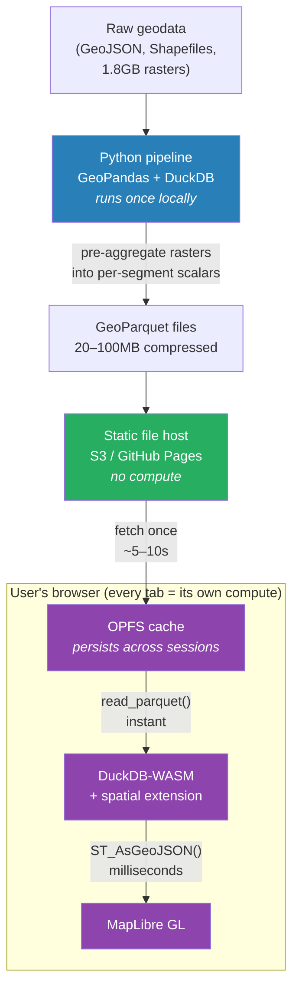

# TTNCRSH Architecture

Trenton crash risk analysis — static web app, no backend.

---

## The usual way

A typical geo web app routes every user interaction through a server: the browser asks a question, the server queries a spatial database, serializes the result, and sends it back.

**Pain points:**
- Every query pays a network round trip (~50–500ms)
- Infrastructure to provision, maintain, and pay for
- Server is a serialization bottleneck — N users share one query engine
- Data leaves the server on every request (matters for sensitive datasets)

---

## Our approach

The pipeline pre-processes everything offline. The browser downloads compressed GeoParquet once, caches it in OPFS, and runs all spatial queries locally via DuckDB-WASM. The server is just a file host.

---

## Why this works for TTNCRSH specifically

| Concern | Traditional | Our approach |
|---|---|---|
| Query latency | 50–500ms per query | <10ms (local CPU) |
| Infrastructure cost | App server + DB server + ops | Static hosting (~$0) |
| Concurrent users | Shared server bottleneck | Each tab is its own engine |
| Raster data (1.8GB DEM, canopy) | Serve tiles or query on demand | Pre-aggregated into scalars in pipeline — never touches browser |
| Data size in browser | N/A | ~20–100MB per dataset after compression |
| Write / real-time data | Straightforward | Not supported — this is read-only |
| Browser support | Universal | Chrome/Edge full (OPFS); Firefox/Safari fall back to in-memory |

### The one-time download tradeoff

The traditional approach pays a small transport tax on every query. This approach pays it once — on first load — and then never again. OPFS is the mechanism that makes "once" actually mean once across sessions, not just within a tab.

### Why rasters stay out of the browser

The elevation DEM and land cover raster together are ~1.8GB uncompressed — too large to ship. The pipeline reads them, computes per-street-segment scalar values (mean elevation change, canopy coverage %, etc.), and writes those scalars into the same GeoParquet files as the vector features. The browser never sees a pixel.

---

## Key technologies

- **DuckDB-WASM** — full DuckDB compiled to WebAssembly; runs spatial SQL in the browser via the `spatial` extension
- **GeoParquet** — columnar geo format (Parquet + WKB geometry); compresses 5–10× vs GeoJSON; `read_parquet()` is DuckDB-native
- **OPFS** (Origin Private File System) — browser-native file storage, not subject to storage quotas like IndexedDB; only accessible to the origin that wrote it
- **MapLibre GL** — open-source WebGL map renderer; accepts GeoJSON sources directly
- **Vite** — serves COOP/COEP headers required for `SharedArrayBuffer`, which DuckDB-WASM needs for multithreading
