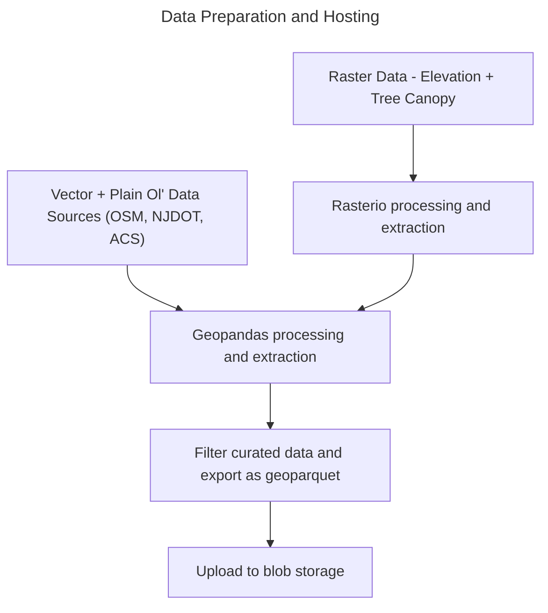
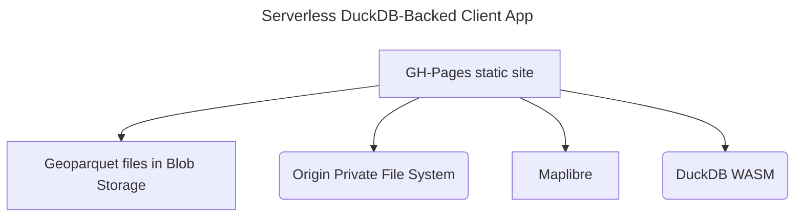

```mermaid
---
title: Data Preparation and Hosting
---
flowchart TB
    raster_data["`Raster Data - Elevation + Tree Canopy`"]
    vector_plain_data["`Vector + Plain Ol' Data Sources (OSM, NJDOT, ACS)`"]
    processing_extraction["`Geopandas processing and extraction`"]
    raster_processing["`Rasterio processing and extraction`"]
    final_filter_extract["`Filter curated data and export as geoparquet`"]
    upload_to_r2_s3["Upload to blob storage"]

    vector_plain_data --> processing_extraction
    raster_data --> raster_processing --> processing_extraction
    processing_extraction --> final_filter_extract --> upload_to_r2_s3

```

```mermaid
---
title: Serverless DuckDB-Backed Client App
---

flowchart TB
    static_app["GH-Pages static site"]
    duckDBWASM("DuckDB WASM")
    OPFS("Origin Private File System")
    blob_storage["Geoparquet files in Blob Storage"]
    maplibre["Maplibre"]

    
    static_app --> blob_storage
    static_app --> OPFS
    static_app --> maplibre
    static_app --> duckDBWASM

```